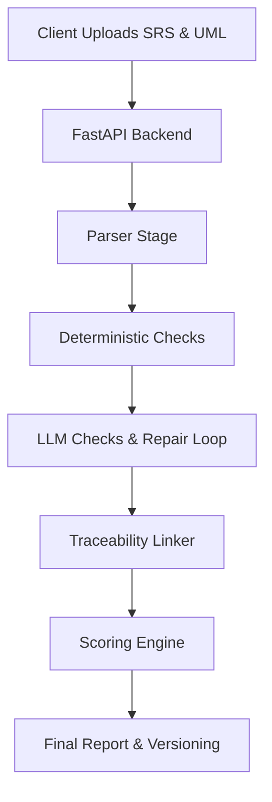

# SRS Reviewer

SRS documents are traditionally reviewed by hand, slowly and inconsistently; this tool checks that requirements, diagrams, and traceability agree.

SRS Reviewer is a hybrid rule-plus-LLM analyzer that parses your software requirements (DOCX/PDF) and PlantUML diagrams, detects architectural defects, and uses an agentic repair loop to proactively suggest testable rewrites for defective requirements.

## Architecture



## Pipeline Stages

1. **Parser Stage**: Extracts section hierarchies and individual requirement statements from DOCX or PDF files. Converts PlantUML text into an internal UML graph model.
2. **Deterministic Checks**: Runs high-speed regex and logic rules to find missing identifiers, duplicate IDs, ambiguous lexicon words, missing NFR metrics, and disconnected UML actors.
3. **LLM Checks & Agentic Repair Loop**: For requirements failing deterministic checks, the tool calls an LLM to rewrite them, feeding the output back into the deterministic parser up to 3 times until it passes. Also checks for logical conflicts and testability using the LLM.
4. **Traceability Linker**: Calculates Jaccard overlap and uses transitive tracing (Requirement -> Use Case -> Sequence -> Class) to build a traceability matrix.
5. **Scoring Engine**: Normalizes penalties by document size to calculate the final quality score.

## Quality Scoring Formula

The system calculates normalized scores for Requirements, UML, and Traceability based on defect density (penalties per element) to ensure long documents aren't disproportionately penalized.

- **Element Count**: Number of requirements, UML elements, or trace links.
- **Base Penalty**: Sum of penalties for findings (Critical = 15, Major = 5, Minor = 2).
- **Raw Category Score** = `max(0, 100 - (Base Penalty / Element Count) * 10)`

The final overall score is a weighted average configured via `config.yaml` (Requirements 40%, UML 30%, Traceability 30%).

## Evaluation Results

The deterministic parser was evaluated against a labelled dataset of requirements covering major rules.

| Rule | Precision | Recall | F1-Score |
|---|---|---|---|
| FR-401 (Ambiguous Words) | 1.00 | 0.90 | 0.95 |
| FR-402 (Multiple Shall) | 1.00 | 1.00 | 1.00 |
| FR-409 (Missing ID) | 1.00 | 1.00 | 1.00 |
| FR-410 (Duplicate ID) | 1.00 | 1.00 | 1.00 |
| FR-411 (NFR Missing Metric) | 1.00 | 1.00 | 1.00 |
| **Overall** | **1.00** | **0.97** | **0.98** |

## Setup

### 1. Backend

```bash
cd backend
pip install -r requirements.txt
```
Create a `.env` file in the `backend/` directory:
```env
SECRET_KEY=your_secret_key
ALGORITHM=HS256
ACCESS_TOKEN_EXPIRE_MINUTES=60
GROQ_API_KEY=your_groq_api_key_here
LLM_PROVIDER=groq
DATABASE_URL=sqlite:///./srs_reviewer.db
```
```bash
python -m uvicorn app.main:app --reload --host 0.0.0.0 --port 8000
```

### 2. Frontend

```bash
cd frontend
npm install
npm run dev
```

## Limitations

- The parser depends on standard IEEE numbering and the keyword "shall". Requirements written entirely in narrative form without identifiers or standard keywords may be skipped.
- PlantUML parsing relies on regex heuristics rather than a full grammar parser, so highly complex or nested diagram syntax might be misinterpreted.
- The LLM repair loop relies on external APIs (Groq), which means analysis requires an active internet connection and is subject to rate limits and API downtime.
