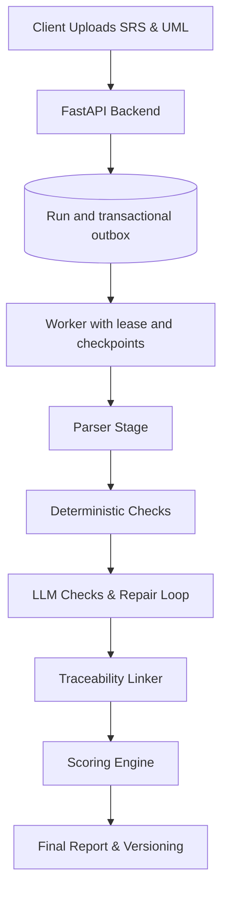

# SRS Reviewer

SRS documents are traditionally reviewed by hand, slowly and inconsistently; this tool checks that requirements, diagrams, and traceability agree.

SRS Reviewer is a hybrid rule-plus-LLM analyzer that parses your software requirements (DOCX/PDF) and PlantUML diagrams, detects architectural defects, and uses an agentic repair loop to proactively suggest testable rewrites for defective requirements.

## Architecture

```mermaid
flowchart TD
    A[Client Uploads SRS & UML] --> B[FastAPI Backend]
    B --> Q[(Run and transactional outbox)]
    Q --> W[Worker with lease and checkpoints]
    W --> C[Parser Stage]
    C --> D[Deterministic Checks]
    D --> E[LLM Checks & Repair Loop]
    E --> F[Traceability Linker]
    F --> G[Scoring Engine]
    G --> H[Final Report & Versioning]
```

## Pipeline Stages

1. **Parser Stage**: Extracts section hierarchies and individual requirement statements from DOCX or PDF files. Converts PlantUML text into an internal UML graph model.
2. **Deterministic Checks**: Runs high-speed regex and logic rules to find missing identifiers, duplicate IDs, ambiguous lexicon words, missing NFR metrics, and disconnected UML actors.
3. **AI checks and reviewed suggestions**: Bounded testability and exhaustive conflict-pair batches validate occurrence coverage and source quotes. Rewrite proposals pass deterministic guards and an advisory semantic comparison, then require a human decision. Accepted or edited suggestions update a draft for fresh analysis; published reports remain immutable. See [AI safety, budgets, and evaluation](docs/AI_SAFETY.md).
4. **Traceability Linker**: Calculates Jaccard overlap and uses transitive tracing (Requirement -> Use Case -> Sequence -> Class) to build a traceability matrix.
5. **Scoring Engine**: Normalizes penalties by document size to calculate the final quality score.

## Quality scoring and evidence

Reviews select requirements-only or requirements-and-architecture scope. Rubric v2 exposes category percentages, eligible counts, and weighted contributions. Missing evidence is not full credit; empty or incomplete analysis has no final grade. Trace scores use stable coverage obligations, while candidate similarity and reviewer confirmation remain distinct. See [the analysis contract](docs/ANALYSIS_CONTRACT.md) for formulas, supported syntax, limitations, and provenance.

## Evaluation

See [the reproducible fixture results](backend/eval/results.md). The evaluator counts each occurrence independently, including missing and duplicate authored IDs. The original small dataset is a development fixture; it does not establish production accuracy or AI reliability. Its generic NFR labels require review under the updated threshold rule. Regression tests additionally cover document extraction, UML, tracing, scoring, access controls, and failure recovery.

## Setup

Use **Python 3.13 and Node 24**. See [the development guide](docs/DEVELOPMENT.md) for setup, migrations, environment configuration, recovery email, Docker, and verification. On Windows run `./run_backend.ps1`, then `npm ci` and `npm run dev` from `frontend`.

Completed phases are merged into `main` after checks pass. See [implementation status](IMPLEMENTATION_STATUS.md) for completed work and remaining acceptance gates, and [worker operations](docs/JOBS.md) for durable execution and recovery. The evaluation above does not establish production accuracy or validate AI rewrites.

## Limitations

- The parser depends on standard IEEE numbering and the keyword "shall". Requirements written entirely in narrative form without identifiers or standard keywords may be skipped.
- PlantUML parsing relies on regex heuristics rather than a full grammar parser, so highly complex or nested diagram syntax might be misinterpreted.
- Deterministic analysis works offline. Optional AI checks use an external provider, configured model prices, and request/token/cost budgets. Their coverage and estimates are visible in reports; live-model accuracy remains a release-qualification measurement.
